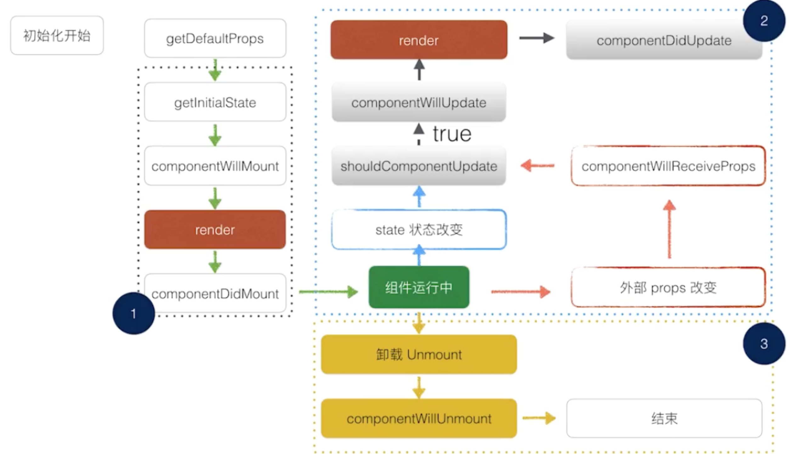
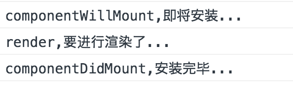
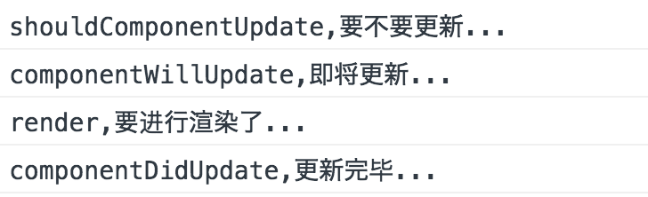

### ReactNative实战开发
- ReactNative的生命周期

</img>

##### 代码区
``` javascript
   timesPlus() {
        let times = this.state.times; // 获取当前状态的次数.
        times++;
        this.setState({
                          times: times
                      });
    }

    componentWillMount() {
        console.log("componentWillMount,即将安装...");
    };

    componentDidMount() {
        console.log("componentDidMount,安装完毕...");
    };

    shouldComponentUpdate()  {
        console.log("shouldComponentUpdate,要不要更新...");
        return true;
    };

    componentWillUpdate() {
        console.log("componentWillUpdate,即将更新...");
    };


    componentDidUpdate() {
        console.log("componentDidUpdate,更新完毕...");
    }


    render() {
        console.log("render,要进行渲染了...");
        return (
            <View style={styles.container}>
                <Text style={styles.welcome} onPress={this.timesPlus.bind(this)}>
                    有本事点我一下
                </Text>
                <Text style={styles.instructions}>
                    你点了我{this.state.times}次
                </Text>
                <Text style={styles.instructions}>
                    杨正友,哎呦不错哦
                </Text>
            </View>
        );
    }
}
```

##### 执行结果
> 启动程序的时候,执行这些生命周期的方法

</img>

> 触发有本事点我一下的时候,执行这些生命周期的方法

</img>
